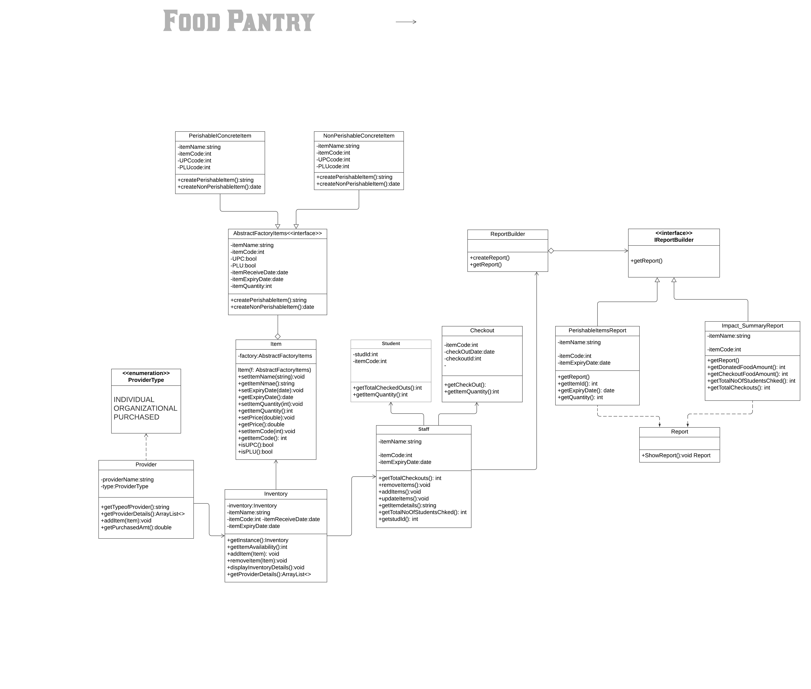
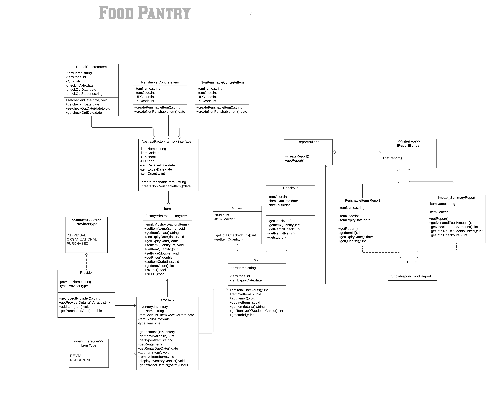

## Maintenance Project
  Diksha Pande, Deepali Patil

# PantryNET

Chico State, like many other universities, has a food pantry for students who do not have access to enough to eat.The pantry provides food for students for free by storing donated and wholesale purchased bulk foods.
We want to create a system to manage the inventory of a food pantry, as well as generate reports about the pantry's activities. We need to design a website that manages the information.

# Getting Started
These instructions will get you a copy of the project up and running on your local machine for development and testing purposes. See deployment for notes on how to deploy the project on a live system.

# Installation
Installation and Running the Program
1. Install Visual Studio Code/Visual Studio( In case of MAC user install Visual Studio  Code/Visual Studio for MAC)
2. Install the .NET Core SDK.

Running the program
1. Save the project folder
2. Open the terminal at the project folder path
3. Run command csc Report.cs
4. Exe file will be generated
5. Run command Report.exe

# Static Analysis using NDepend

Static code analysis is a method of debugging by examining source code before a program is run. We used NDepend to check the static analysis of our C sharp code.

NDepend is a static analysis tool for .NET managed code.

The tool supports a large number of code metrics that allow one to visualize dependencies using directed graphs and dependency matrix. The tool also performs code base snapshot comparisons, and validation of architectural and quality rules. User-defined rules can be written using LINQ queries. This feature is named CQLinq. The tool also comes with a large number of predefined CQLinq code rules. Code rules can be checked automatically in Visual Studio or during continuous integration.
We have to add the NDepend extension to our Visual Studio, from that extension we can easily generate the report and see the detailed analysis of the code.
NDepend is charged software.


For more information please go thorugh below link:
```{bash}
$ /bin/bash -c "$(curl -fsSL https://en.wikipedia.org/wiki/NDepend)"
```

## Initial Contributors

Contributors are present in [Contributors](CONTRIBUTOR.md)

## Licensing

This project is licensed following the MIT licene given in
[License](LICENSE).

## References
$ /bin/bash -c "$(curl -fsSL https://www.google.com/)"

## Acknowledgement

* [Dr. Kevin Buffardi GitHub](https://github.com/kbuffardi)
* [CSU Chico Portal](https://www.csuchico.edu/basic-needs/pantry.shtml)
* [Search Engine](https://www.google.com/)

# UML Class Diagram before the change



# UML Class Diagram after the change




# Continuous Integration - Travis CI

Travis CI is a hosted, distributed continuous integration service used to build and test projects hosted at GitHub.

It automatically detects when a commit has been made and pushed to a GitHub repository that is using Travis CI, and each time this happens, it will try to build the project and run tests.

travis. yml , which is a YAML format text file, to the root directory of the repository.

This file specifies the programming language used, the desired building and testing environment (including dependencies which must be installed before the software can be built and tested), and various other parameters.

[](https://travis-ci.com/Dikshap/PantryNET.svg?branch=master)
